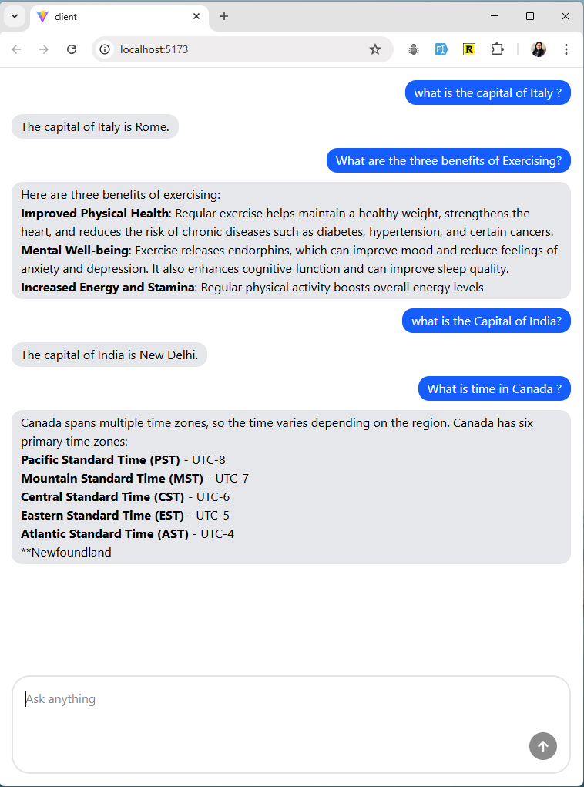

# CHATBOT APPLICATION

A modern, full-stack chatbot application powered by OpenAI's GPT-4o-mini model, built with React, TypeScript, and Node.js.



## Features

- 🤖 AI-Powered Conversations - Integrated with OpenAI's GPT-4o-mini model for intelligent responses
- 💬 Real-time Chat Interface - Smooth, responsive chat experience
- 🎨 Modern UI - Built with React and styled with Tailwind CSS
- 🔒 Type-Safe - Full TypeScript implementation across frontend and backend
- ✅ Input Validation - Backend validation using Zod schemas
- ⚡ Fast Development - Powered by Bun runtime for optimal performance
- 🎯 Configurable AI Parameters - Customizable tokens and temperature settings

## Tech Stack

### **Frontend**

- React - UI library
- TypeScript - Type safety
- Tailwind CSS - Utility-first styling
- Bun - Build tool and dev server

### **Backend**

- Node.js - Runtime environment
- Bun - Fast JavaScript runtime and package manager
- Express.js - Web framework
- Zod - Schema validation
- OpenAI API - GPT-4o-mini integration

### Code Quality

- ESLint - Linting
- Prettier - Code formatting

### Prerequisites

Before you begin, ensure you have the following installed:

- Bun (latest version)
- Node.js (v18 or higher)
- OpenAI API key

### Installation

- Clone the repository
  git clone <repository-url>
  cd chatai-app

- Install dependencies

```bash
bun install
```

- Set up environment variables
  Create a .env file in the root directory:
  OPENAI_API_KEY=your_openai_api_key_here

### Running the Application

Start both frontend and backend in development mode:
To run:

```bash
bun run dev
```

This project was created using `bun init` in bun v1.2.23. [Bun](https://bun.com) is a fast all-in-one JavaScript runtime.

### Performance Optimization

- Token management to reduce API costs
- Conversation history truncation for long chats
- Response caching for common queries (optional)

Built with ❤️ using React, TypeScript, and OpenAI
